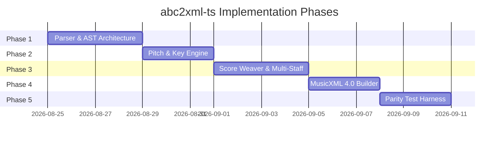

# Architecture & Implementation Plan: `abc2xml-ts`

A standalone, zero-dependency, pure TypeScript library for converting **ABC Music Notation (v2.1)** into **MusicXML 4.0** with 100% parity against Willem Vree's reference `abc2xml.py`.

---

## 1. Project Overview & Objectives

### Goal
Provide the JavaScript and TypeScript ecosystem with a gold-standard, browser-safe, high-fidelity ABC $\to$ MusicXML converter that matches MuseScore, Sibelius, Dorico, and Finale import expectations.

### Non-Goals
- Visual rendering (handled by `abcjs` or `OSMD`).
- MusicXML $\to$ ABC import (handled by `@educandu/abc-tools` / `xml2abc.cjs`).

---

## 2. Technical Architecture & Pipeline

The conversion pipeline consists of 4 decoupled, pure stages:


```
abc2xml-ts/
├── src/
│   ├── parser/
│   │   ├── tokens.ts          # Lexical tokens for headers, notes, chords, symbols
│   │   ├── lexer.ts           # Character-level scanner & line classifier
│   │   ├── grammar.ts         # ABC v2.1 recursive-descent parser
│   │   └── ast.ts             # Strongly typed AST definitions
│   ├── engine/
│   │   ├── scoreWeaver.ts     # Compiles %%score expressions into grand-staves/parts
│   │   ├── pitchEngine.ts     # Computes exact <alter> from key signatures & local accidentals
│   │   ├── durationEngine.ts  # Normalizes fractional durations, broken rhythms (> <), tuplets
│   │   ├── voiceAligner.ts    # Measure-by-measure cross-voice timeline synchronization
│   │   └── notationEngine.ts  # Maps fingerings, dynamics, arpeggios, slurs, ornaments
│   ├── serializer/
│   │   ├── xmlBuilder.ts      # Fast, lightweight DOM/XML builder (zero external XML lib)
│   │   └── musicXml4.ts       # MusicXML 4.0 schema emitters (part-list, score-part, measure, note)
│   └── index.ts               # Public interface: abc2xml(abcString, options)
├── tests/
│   ├── unit/                  # Parser & Engine unit tests
│   ├── fixtures/              # Test corpus (Mozart, Bach, folk, polyphonic, multi-staff)
│   └── golden/                # Automated parity tests comparing against Python abc2xml.py
├── package.json
└── tsconfig.json
```

---

## 3. Core Engine Specifications

### 3.1 Lexer & Grammar (`src/parser/`)
- **Headers & Directives:**
  - `X:` (Index), `T:` (Title / Subtitle), `C:` (Composer), `M:` (Meter), `L:` (Unit note length), `Q:` (Tempo), `K:` (Key signature), `V:` (Voice definition with `clef=`, `name=`, `subname=`, `octave=`, `merge`), `%%score` (Staff grouping matrix).
- **In-line Fields:**
  - In-line key changes `[K:A]`, meter changes `[M:3/4]`, tempo `[Q:1/4=120]`, clef changes `[V:1 clef=bass]`.
- **Note & Pitch Syntax:**
  - Octaves: uppercase `C,`, `C`, lowercase `c`, `c'`, `c''`.
  - Microtones / Accidentals: `__` (double flat), `_` (flat), `=` (natural), `^` (sharp), `^^` (double sharp), `^/` / `_/` (quarter tones).
  - Durations: integers/fractions `C2`, `C/2`, `C3/4`, `C/`, `C//`.
  - Broken Rhythms: `A>B` ($3/2, 1/2$), `A>>B` ($7/4, 1/4$), `A<B`, `A<<B`.
- **Chords & Polyphony:**
  - `[CEG]`, `[c2e2g2]`, chords containing individual note decorations and ties.
- **Decorations & Articulations:**
  - Fingerings: `!1!`, `!2!`, `!3!`, `!4!`, `!5!`.
  - Dynamics: `!p!`, `!pp!`, `!f!`, `!ff!`, `!mf!`, `!mp!`, `!sfz!`.
  - Ornaments & Directions: `!arpeggio!`, `!trill!`, `!fermata!`, `!>!`, `!<(!`, `!>)!`.
  - Staccato dots: `.a`, `.c`, `.[ce]`.
  - Grace notes: `{g}`, `{/d}`, `{!1!ga}`.
  - Tuplets: `(3p:q:r`, `(3`, `(5`, `(6`.

---

### 3.2 Pitch & Key Signature Engine (`src/engine/pitchEngine.ts`)

> [!IMPORTANT]
> **Accidental Parity Invariant:**  
> MusicXML requires `<alter>` in `<pitch>` for sounding pitch, even when accidental is implicit from the key signature.

1. **Key Signature Map:**  
   Given key signature (e.g., $K:A$, 3 sharps: $F, C, G$), maintain a map:
   $$\text{KeyAlterations} = \{ F \to 1, C \to 1, G \to 1, D \to 0, A \to 0, E \to 0, B \to 0 \}$$
2. **Measure Accidental Memory:**  
   Track explicit in-measure accidentals (`^c`, `_B`, `=F`) per octave. Local accidentals override key alterations for the remainder of the measure.
3. **Sounding Pitch Calculation:**  
   - If note has explicit accidental $\implies$ set `<alter>` and emit `<accidental>` tag.
   - If note has key-implied alteration $\implies$ set `<alter>`, omit `<accidental>` tag.
   - If note is natural under a sharp/flat key signature $\implies$ set `<alter>0</alter>`, emit `<accidental>natural</accidental>`.

---

### 3.3 Score Weaver & Staff Allocator (`src/engine/scoreWeaver.ts`)

Converts multi-voice ABC declarations into standard MusicXML instrument and staff hierarchies:

1. **Parse `%%score` Expressions:**
   - Sequential voices: `( 1 2 )` $\implies$ Voice 1 and Voice 2 share the same staff (Staff 1).
   - Staff split: `( 1 2 ) | 3` $\implies$ Grand staff: Upper staff (Voices 1 & 2), Lower staff (Voice 3).
   - Multiple instruments: `{ ( 1 2 ) | 3 } { 4 | 5 }` $\implies$ Part 1 (Piano, 2 staves), Part 2 (Organ, 2 staves).
2. **Voice & Staff Indexing:**
   - Emit `<staves>2</staves>` in measure attributes.
   - Direct notes to `<staff>1</staff>` or `<staff>2</staff>` and `<voice>1</voice>`, `<voice>2</voice>`, etc.
3. **General MIDI Instrument Synthesis:**
   - Map standard voice names (`"Piano"`, `"Violin"`, `"Flute"`) to General MIDI programs in `<score-part>` / `<midi-instrument>`.

---

## 4. Phased Implementation Roadmap



### Phase 1: Lexer, Parser & AST
- Build token definitions and character scanner.
- Implement header parser (`X:`, `T:`, `M:`, `L:`, `K:`, `Q:`, `V:`, `%%score`).
- Implement voice line parser (notes, rests, barlines, chords, tuplets, annotations).

### Phase 2: Pitch & Key Engine
- Implement 12-tone circle of fifths key signature tables.
- Implement in-measure accidental state tracker.
- Implement modal keys (`K:Am`, `K:Ddor`, `K:Gmix`) and explicit accidentals (`K:HP`).

### Phase 3: Score Weaver (`%%score`)
- Grammar for nested `%%score` bracket trees (`{ }`, `( )`, `|`).
- Route voice lines to part and staff indices.
- Handle voice clef assignments (`V:1 treble`, `V:3 bass`, `V:alto`).

### Phase 4: MusicXML 4.0 Serializer
- Build lightweight XML emitter with indentation and escaping.
- Emit `<score-partwise>`, `<part-list>`, `<score-part>`, `<midi-instrument>`.
- Emit measures with `<attributes>`, `<clef>`, `<key>`, `<time>`, `<divisions>`.
- Emit notes with `<pitch>`, `<duration>`, `<type>`, `<notations>` (`<fingering>`, `<arpeggiate>`, `<staccato>`, `<slur>`, `<dynamics>`, `<wedge>`).

### Phase 5: Golden Parity Test Suite
- Download and run Python `abc2xml.py` as reference oracle.
- Build automated test runner asserting XML structural and musical equivalence across test corpus:
  - Mozart Rondo Alla Turca (Piano grand staff, fingerings, key changes, arpeggios).
  - Bach Chorales (4-part vocal/choral SATB).
  - Multi-voice Celtic / Folk tunes (tuplets, grace notes, broken rhythm).

---

## 5. Public API Design

```typescript
export interface Abc2XmlOptions {
  /** Title to use if the ABC score lacks T: headers */
  fallbackTitle?: string;
  /** Indentation spaces in generated XML (default: 2) */
  indent?: number;
  /** MusicXML version string (default: "4.0") */
  version?: '3.1' | '4.0';
  /** Target software name in XML header (default: "abc2xml-ts") */
  software?: string;
}

export interface Abc2XmlResult {
  /** Valid MusicXML 4.0 document string */
  xml: string;
  /** Non-fatal warnings encountered during conversion */
  warnings: string[];
}

/**
 * Converts an ABC v2.1 string into a MusicXML document.
 * @throws {AbcParseError} if ABC source is empty or invalid
 */
export function abc2xml(abcSource: string, options?: Abc2XmlOptions): Abc2XmlResult;
```
