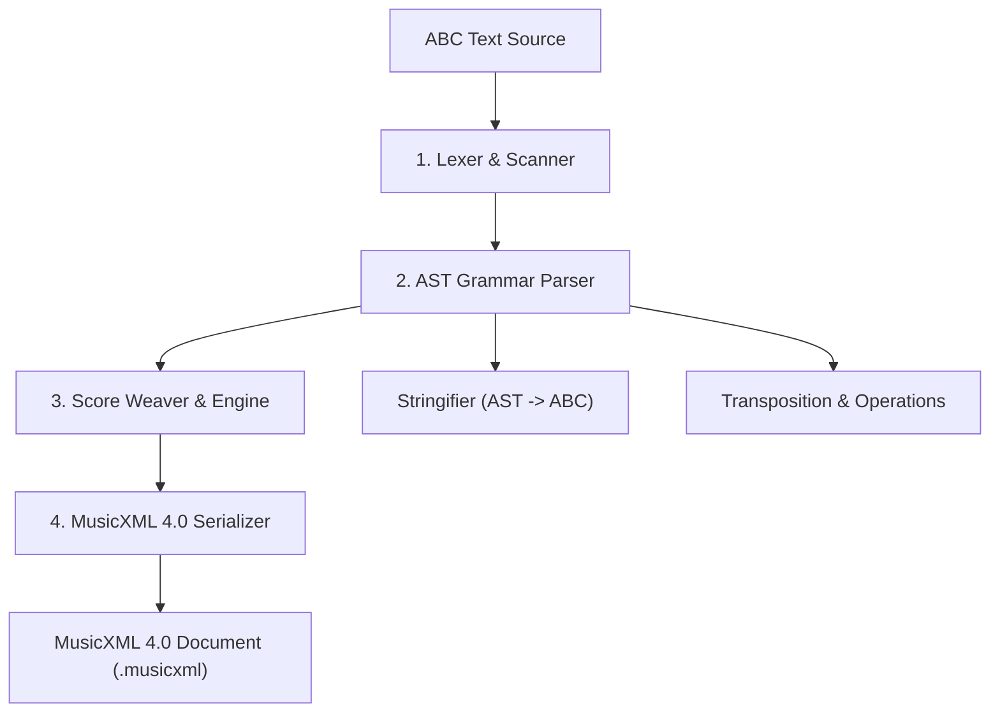

# `abc-utils` Architecture & System Design

## 1. System Overview

`abc-utils` is a standalone, zero-dependency, pure TypeScript library providing comprehensive toolkits for **ABC Music Notation (v2.1)** parsing, AST inspection, score manipulation (transposition, voice filtering, tune book splitting), and high-fidelity **MusicXML 4.0** conversion.

---

## 2. 4-Stage Conversion & Processing Pipeline

The core conversion engine consists of 4 decoupled, pure stages:



### Stage 1: Lexer (`src/parser/lexer.ts`)
- Pre-processes input lines, resolves line continuations (`\`), strips inline comments (`%`), and isolates directives (`%%score`).
- Tokenizes music lines into discrete tokens: notes, rests, octave markers, accidentals, durations, chords, broken rhythms, tuplets, grace notes, barlines, slurs, ties, decorations, and annotations.

### Stage 2: Grammar Parser (`src/parser/grammar.ts`)
- Implements an LL(1) / recursive-descent parser.
- Constructs a strongly-typed `AbcTuneAST` containing structured headers, voice declarations, measure-by-measure element lists, chords, and lyric attachments.

### Stage 3: Music Engine & Score Weaver (`src/converters/abc2xml/scoreWeaver.ts`, `src/core/`)
- Evaluates `%%score` / `%%staves` matrix trees into Part, Staff, and Voice hierarchies.
- Computes sounding pitch and accidental alterations per measure/octave.
- Calculates exact fractional timing and determines the Lowest Common Multiple (LCM) for measure `<divisions>`.

### Stage 4: MusicXML 4.0 Serializer (`src/converters/abc2xml/musicXml4.ts`, `src/converters/abc2xml/xmlBuilder.ts`)
- Emits fully-formed, schema-compliant MusicXML 4.0 / 3.1 documents.
- Manages multi-voice `<backup>` and `<forward>` timeline synchronization.
- Maps decorations to dynamics, articulations, ornaments, technical notations, and guitar chords into `<harmony>`.
- Analyzes measure durations (`computeMeasurePlans`) to handle anacrusis (pickup measures as `<measure number="0" implicit="yes">`) and split repeat measures (sharing measure numbers with `implicit="yes"` across repeat barlines).

---

## 3. Directory & Component Layout

```
abc-utils/
├── src/
│   ├── core/                  # Shared music theory primitives & math
│   │   ├── rational.ts        # Exact fractional arithmetic (LCM, GCD, beat math)
│   │   ├── pitch.ts           # Note steps, accidentals, frequencies, MIDI note numbers
│   │   ├── key.ts             # Circle of fifths, modes, key signature alteration maps
│   │   ├── clef.ts            # Clef definitions, transpositions, octave shifts
│   │   ├── time.ts            # Meter, tempo, beat divisions, unit note lengths
│   │   └── index.ts           # Barrel export
│   │
│   ├── parser/                # Gold-standard ABC v2.1 Parser & Formatter
│   │   ├── tokens.ts          # Lexer token definitions
│   │   ├── lexer.ts           # Character scanner & line classifier
│   │   ├── ast.ts             # Strongly typed AST definitions
│   │   ├── grammar.ts         # Recursive-descent AST parser
│   │   ├── stringifier.ts     # AST -> formatted/canonical ABC text serializer
│   │   └── index.ts           # parseAbc(), stringifyAbc(), tokenizeAbc()
│   │
│   ├── operations/            # Music manipulation & inspection tools
│   │   ├── transpose.ts       # Transpose ABC / AST by semitones or interval
│   │   ├── book.ts            # Multi-tune book parser, splitter, and indexer (X:1, X:2...)
│   │   ├── lyrics.ts          # Syllable extraction and lyric manipulation
│   │   ├── validator.ts       # Syntax validator and linter
│   │   └── index.ts           # Unified operations exports
│   │
│   ├── converters/            # Format converters
│   │   ├── abc2xml/           # ABC -> MusicXML 4.0 converter
│   │   │   ├── scoreWeaver.ts # %%score matrix compiler (grand-staves, parts)
│   │   │   ├── notationEngine.ts # Articulations, dynamics, fingerings, ornaments
│   │   │   ├── xmlBuilder.ts  # Fast zero-dependency XML DOM builder
│   │   │   ├── musicXml4.ts   # MusicXML 4.0 schema serializer
│   │   │   └── index.ts       # abc2xml() converter API
│   │   │
│   │   └── xml2abc/           # [Future] MusicXML -> ABC converter
│   │
│   ├── types.ts               # Universal types and error definitions
│   └── index.ts               # Umbrella public API: exports all utilities & converters
```

---

## 4. Module Boundaries & Dependencies

- **Zero Runtime Dependencies**: `abc-utils` uses no external npm packages at runtime.
- **Isomorphic**: Runs identically in Node.js (>= 18), modern browsers, Deno, and Bun.
- **Tree-Shakeable Subpaths**: Package exports allow importing specific modules (`abc-utils/abc2xml`, `abc-utils/parser`, `abc-utils/core`, `abc-utils/operations`).
